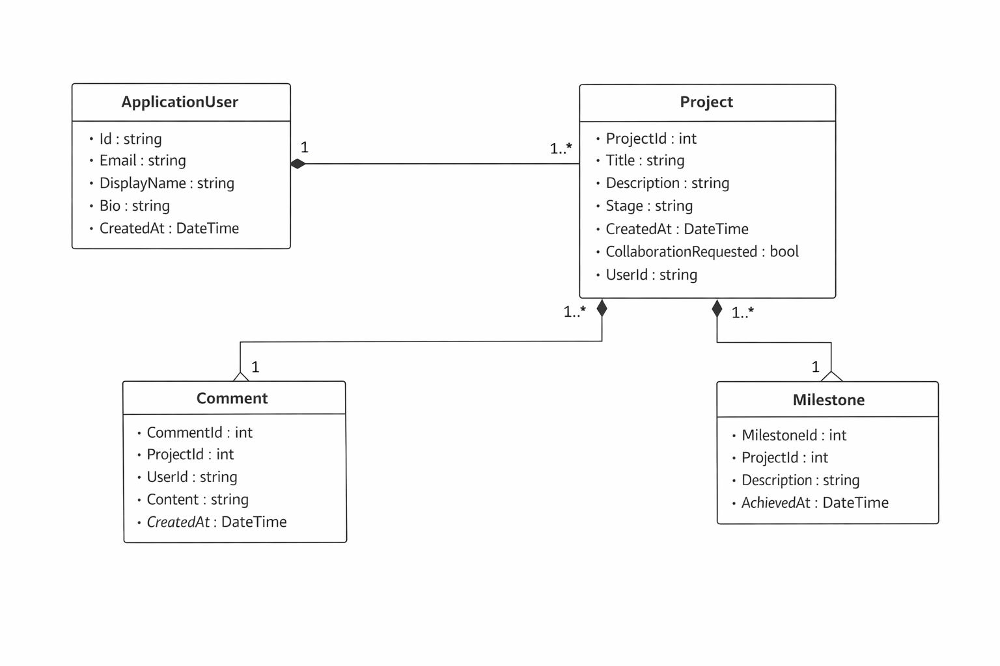

# MzansiBuilds – System Architecture

## 1. Architecture Type
The system uses ASP.NET Core MVC architecture.

## 2. System Layers

### Presentation Layer (Views)
- Razor Views (.cshtml)
- Handles UI and user interaction

### Controller Layer
- Processes user requests
- Handles business logic flow
- Communicates between Views and Models

### Model Layer
- Represents application data
- Includes entities such as User and Project

### Data Access Layer
- Entity Framework Core
- Handles database communication

## 3. System Flow
User → View → Controller → Model → Database → Model → Controller → View

## 4. Key Components
- ASP.NET Core MVC
- Identity Authentication System
- Entity Framework Core ORM
- SQL Server Database

## 5. UML Diagram

Below is the system design UML diagram:

